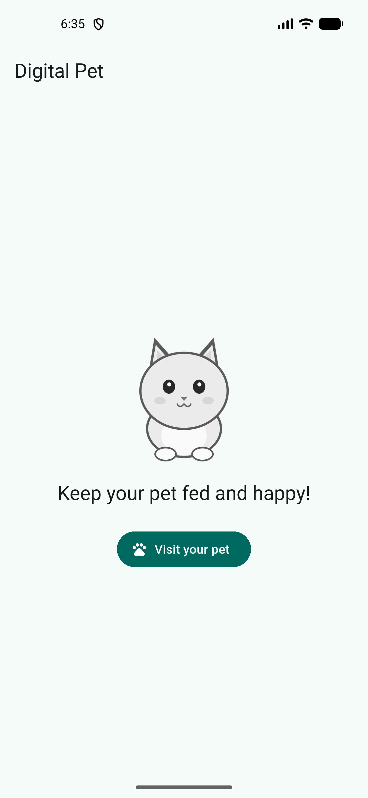
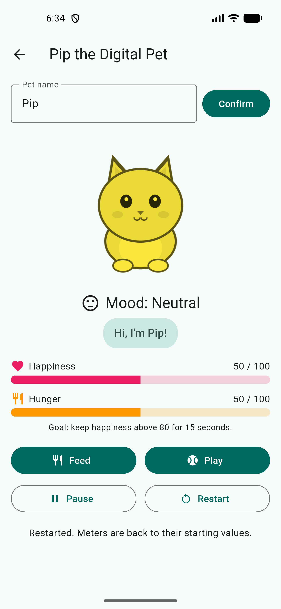
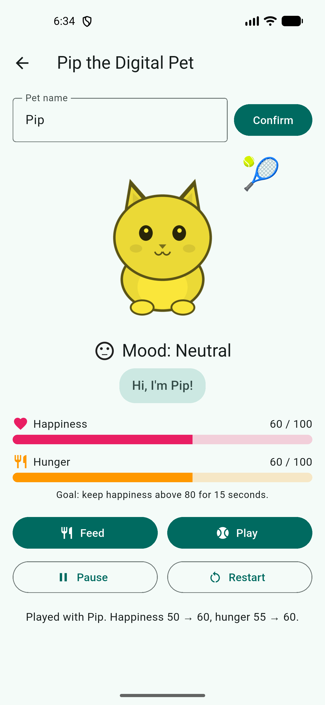
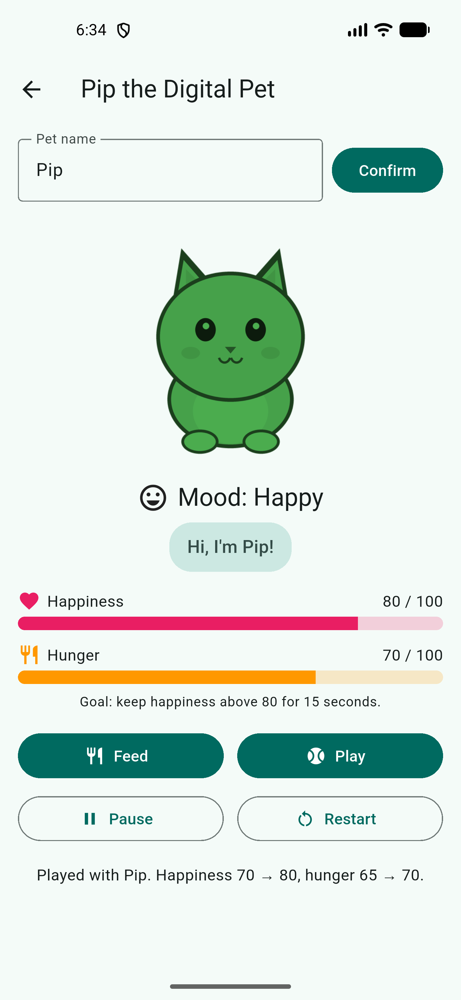
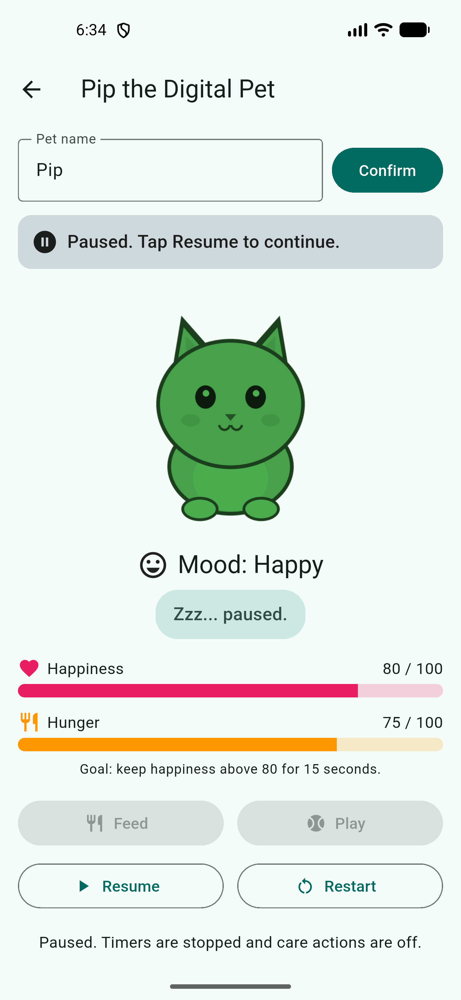
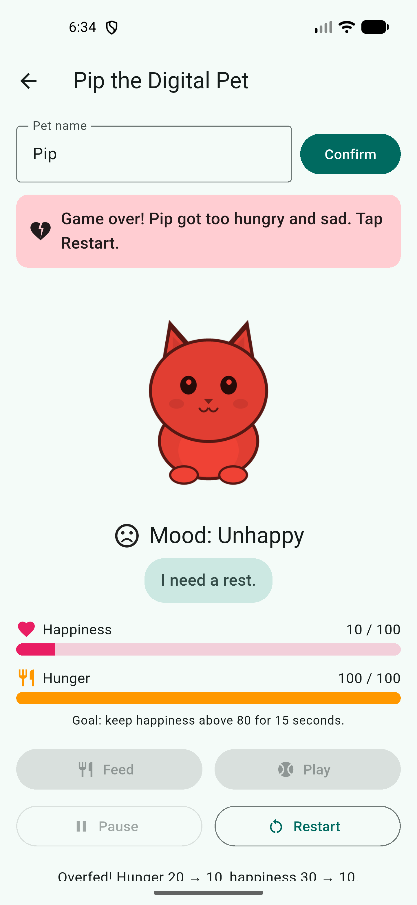
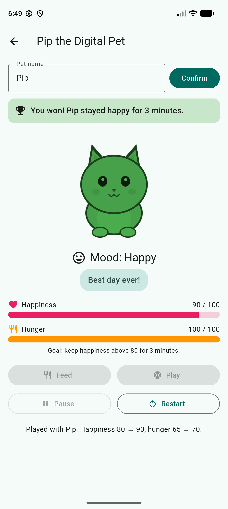

# ICW_07 · Digital Pet State Lab

In-Class Activity 07 for Mobile Application Development (GSU). A Flutter pet-care app that turns user actions and time into visible state changes using `StatefulWidget`, `setState()`, lifecycle-aware timers, and accessible feedback.

**Repository:** https://github.com/Icecoldblack/ICW_07
**Release APK:** `DigitalPet_Nehikhuere.apk` (submitted separately to iCollege, not committed)

## Team, roles, and pathway

| Member | Pathway | Team / workstream | Role |
|---|---|---|---|
| Uyiosa (Caleb) Nehikhuere | Undergraduate | Team 1 · Care Systems and Team 2 · Pet Personality | Coordinator, state owner, UI owner, quality reviewer |
| _Add teammates here_ | Undergraduate | | |

**Undergraduate advanced features selected (2):**

1. **Session controls**: Pause / Resume and Restart that handle both timers and the outcome safely.
2. **Visual polish & accessible motion** (counts as one feature): action bounce, living meters, expression switch, action reactions, mood tint & size, derived pet speech, and reduced-motion support.

## Setup, run, test, build

```bash
git clone https://github.com/Icecoldblack/ICW_07.git
cd ICW_07
flutter pub get
flutter analyze            # No issues found
flutter test               # 19 widget tests, all passing
flutter run                # on an Android emulator or device
flutter build apk --release
```

Fast manual testing only: `flutter run --dart-define=FAST_TIMERS=true` shortens hunger ticks to 5 s and the win to 15 s. A normal build (including the release APK) always uses the production values: **hunger +5 every 30 seconds** and **win after 3 continuous minutes above 80**.

## Core behavior (team rules)

| Rule | Implementation |
|---|---|
| Meters | Happiness and hunger on 0 to 100, clamped in one helper `_clampMeter()` |
| Mood label + tint | `> 70` Happy / green, `30 to 70` Neutral / yellow, `< 30` Unhappy / red. `ColorFiltered` with `BlendMode.modulate` on one grayscale PNG, plus a text label and face icon so color is never the only signal |
| Name | `TextField` + Confirm button; the `TextEditingController` is disposed in `dispose()` |
| Feed | Hunger −10. If the resulting hunger is below 30 (overfed), happiness −20, otherwise +10 |
| Play | Happiness +10, hunger +5 |
| Hunger timer | One `Timer.periodic(30 s)` created in `initState()`, cancelled in `dispose()`, on pause, and on a terminal outcome. 95 → 100 has no penalty; a later tick that would pass 100 clamps hunger and costs 20 happiness |
| Win | Happiness strictly `> 80` for 3 continuous minutes. A one-shot timer starts on the first crossing above 80 and is cancelled and cleared at 80 or below |
| Loss | Hunger 100 and happiness ≤ 10 → Game over. Care actions and Pause are disabled until Restart |
| Restart | Restores starting meters and outcome flags, cancels the win timer, and starts exactly one hunger timer |

`_updateOutcome()` runs after every user action and every hunger tick. All related fields change together in one `setState()` call, and `setState()` is never called from `build()`.

## Advanced features

| Feature | User flow | State that changes and why |
|---|---|---|
| Session controls | Tap **Pause** → banner "Paused", Feed/Play disabled, meters freeze. Tap **Resume** → hunger ticks again. Tap **Restart** any time | `_isPaused` toggles. Pause cancels the hunger timer and the win timer so no time passes while paused. Resume starts exactly one new hunger timer and, if happiness is still above 80, a fresh 3‑minute win timer (a pause breaks the "continuous" streak) |
| Visual polish & accessible motion | Feed/Play: pet bounces, 🍖 or 🎾 floats up, bars glide, speech bubble cross‑fades | `_bouncing` and `_reaction` are short-lived presentation state with their own timers that are replaced on each action and guarded by `mounted`. Tint, scale, mood label, and speech are **derived** from happiness/hunger/outcome so they cannot drift out of sync. With *Remove animations* turned on, all durations are `Duration.zero` and the pet does not bounce, but the reaction emoji, messages, and values remain |

## Feature-to-learning-outcome map

| Feature | Learning outcome | Evidence |
|---|---|---|
| Pause / Resume / Restart | Start periodic work in `initState()` and cancel it in `dispose()`; keep exactly one timer | Tests `pause stops hunger…`, `pausing cancels the win streak…`, `restart restores meters and a single hunger timer` |
| Action bounce + reactions | UI responds to state; delayed callbacks respect widget lifecycle | `_react()` cancels earlier timers and checks `mounted`; test `leaving the pet screen cancels timers` |
| Mood tint and size | Color and scale derive from happiness using the same thresholds as the label | Tests at 29 / 30 / 70 / 71 check label, `ColorFilter`, and scale |
| Living meters | `build()` reads state-derived values without side effects | `TweenAnimationBuilder` targets `value / 100`; numeric values come straight from state |
| Expression switch / pet speech | Derived presentation, one source of truth | `_petMessage` getter keyed by `ValueKey(message)` in an `AnimatedSwitcher` |
| Reduced-motion support | Interaction stays usable with motion disabled | Test `reduced motion uses zero-duration animations` |

## Test evidence

### Automated (`flutter test`)

```
00:05 +19: All tests passed!
```

### Manual test matrix

Manual tests were run on the **Pixel 5 (API 37) emulator inside Android Studio** using a debug build with `FAST_TIMERS=true` (hunger every 5 s, win after 15 s). Exact boundary values that are hard to reach by tapping were verified with widget tests using the production 30 s / 3 min timers (fake clock).

| Scenario | Expected result | Result / evidence |
|---|---|---|
| Feed at hunger 5; feed at hunger 95 | Hunger stays in 0 to 100; happiness rule uses the resulting hunger | Pass. Widget tests: 5 → 0 with happiness 50 → 30; 95 → 85 with happiness 50 → 60. On the emulator, feeding at hunger 25 showed "Overfed! Hunger 25 → 15, happiness 50 → 30" |
| Play at happiness 95 | Happiness clamps at 100 and the UI explains it | Pass. Widget test shows 100 and the message "Happiness is maxed at 100" |
| Happiness at 29, 30, 70, 71 | 29 Unhappy/red, 30 and 70 Neutral/yellow, 71 Happy/green; text label always shown | Pass. Widget tests check label, `ColorFilter`, and scale at all four values. Emulator: 50 and 60 yellow/Neutral, 80 green/Happy, 10 red/Unhappy (screenshots below) |
| Happiness exactly 80 | Does not start the win timer (strictly greater than 80) | Pass. Emulator at 80 kept showing "Goal: keep happiness above 80"; widget test `exactly 80 does not start the win timer` |
| Above 80 for 2:59, then drops to 80 or below | No win; pending win timer cancelled and cleared | Pass. Widget test: 2:59 at 85, feed drops happiness to 65, one more minute passes with no win |
| Above 80 again for 3:00 | Win at three continuous minutes; hunger timer stops | Pass. Widget test wins at 3:00 and hunger stays frozen afterwards. Emulator (fast timers): happiness 90 for 15 s showed "You won! Pip stayed happy for 15 seconds", Feed/Play/Pause disabled |
| Hunger 95 → 100, then another tick | First tick: no penalty. Next tick: hunger stays 100, happiness −20 | Pass. Widget test: 95 → 100 with happiness 50, then 100 with happiness 30 |
| Hunger 100 and happiness 10 | Game over; state stops changing until Restart | Pass. Emulator: left the pet at happiness 10 until hunger hit 100 → "Game over! Pip got too hungry and sad", all care controls disabled. Widget test confirms values stay fixed for 2 more minutes |
| Restart | Starting meters return, exactly one hunger timer | Pass. Emulator: Restart from Game over returned 50 / 50. Widget test checks exactly +5 per interval after restart |
| Pause / Resume (Session controls) | Pause freezes meters and disables care; Resume restarts one hunger timer; pause breaks the win streak | Pass. Emulator: hunger stayed at 75 for over 10 s while paused, Feed/Play disabled, Resume continued ticking. Widget tests cover both behaviors |
| Leave the pet screen while the timer is active | Timer cancelled; no post-dispose update | Pass. Emulator: back arrow to the home screen, `adb logcat` showed no Flutter errors. Widget test pumps 5 more minutes after leaving with no exception |
| Visual polish + reduced motion | Derived message, tint/scale, animated meters; reduced motion removes movement | Pass. Emulator: bounce, 🍖/🎾 reaction, gliding bars, speech changes ("Hi, I'm Pip!", "Play with me?", "I'm starving!", "Best day ever!", "I need a rest."). Widget test with `disableAnimations: true` checks zero durations and no bounce |
| Release APK smoke test | Release build installs and launches | Pass. `flutter build apk --release` (45.8 MB) installed on the Android Studio Pixel 5 emulator, cold launch in 2.7 s, Visit and Feed worked (50/50 → 60/40), and the goal text read "above 80 for 3 minutes", confirming production timers |
| Release APK on **Pixel 9 Pro XL (API 37.2)** in Android Studio | Release build runs with production timers; real 3 minute win | Pass. Installed `DigitalPet_Nehikhuere.apk`, played to happiness 90, waited a real 3 minutes: "You won! Pip stayed happy for 3 minutes.", hunger stopped at 100, Feed/Play/Pause disabled (screenshot 07) |

## Screenshots

| Home | Neutral (yellow) | Play reaction | Happy (green) | Paused | Game over (red) |
|---|---|---|---|---|---|
|  |  |  |  |  |  |

**Win on Pixel 9 Pro XL (release APK, real 3 minute timer):**



All screenshots are real captures from the Android Studio Pixel 5 and Pixel 9 Pro XL emulators (`adb shell screencap`).

## Collaboration evidence

Work was tracked in GitHub issues and merged into `main` only through pull requests from short-lived branches:

| Item | Link |
|---|---|
| Issue: Core care loop (meters, timers, win/loss, reset) | [#1](https://github.com/Icecoldblack/ICW_07/issues/1) |
| Issue: Session controls (pause / resume / restart) | [#2](https://github.com/Icecoldblack/ICW_07/issues/2) |
| Issue: Visual polish & accessible motion | [#3](https://github.com/Icecoldblack/ICW_07/issues/3) |
| PR: `team-1/care-systems` → `main` (app, features, widget tests) | [#4](https://github.com/Icecoldblack/ICW_07/pull/4) |
| PR: `team-2/pet-personality` → `main` (README evidence, screenshots, asset notes) | [#5](https://github.com/Icecoldblack/ICW_07/pull/5) |

Teammates: add yourselves to the team table above, and leave your cross-team review on the other team's pull request so it shows in the history.

## Asset attribution

`assets/pet.png` is an original grayscale cat illustration drawn for this project (no third-party license). It is light gray on a transparent background so `BlendMode.modulate` tints it clearly.
